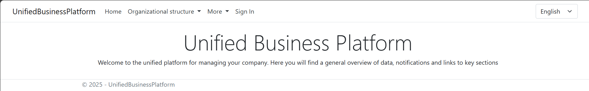
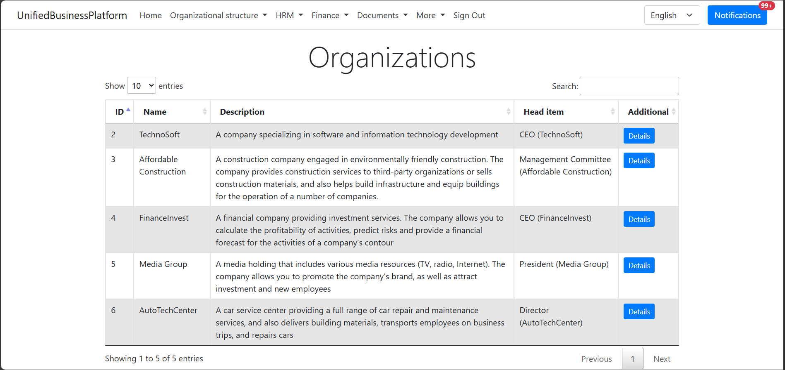

# velocipede-utils 

[English](README.md) | [Русский](README.ru.md)

Этот проект представляет собой централизованную библиотеку, предоставляющую широкий спектр функций: переиспользуемые модели данных, сервисы и расширения, которые предназначены для упрощения и ускорения разработки бизнес-приложений, в частности, в областях ERP и CRM.

## Идея

Эта библиотека создана для решения проблемы дублирования кода и разрозненности объектных моделей при разработке бизнес-приложений. Например, ранее у меня часто возникала необходимость создания идентичных сущностей и сервисов в разных проектах, что приводило к потере времени и усложняло поддержку. Стоит отметить, что у каждого проекта был свой репозиторий, что усложняло интеграцию между проектами и возможность изменения объектной модели.

В результате, было принято решение о создании монорепозитория, куда вошла большая часть ранее созданных проектов, а также общая объектная модель для представления данных в БД. Такой подход позволяет:
- Избежать дублирования кода.
- Обеспечить консистентность данных между проектами.
- Сократить время разработки за счет повторного использования готовых компонентов.
- Упростить рефакторинг и управление зависимостями.

## Проекты

### Shared

Список общих проектов (переиспользуемые модели данных, сервисы и расширения):

- [AuthenticationService](VelocipedeUtils/Shared/AuthenticationService/README.ru.md)
- [CodeExtensions](VelocipedeUtils/Shared/src/CodeExtensions/README.ru.md)
- [Communication](VelocipedeUtils/Shared/Communication/README.ru.md)
- [Models](VelocipedeUtils/Shared/src/Models/README.ru.md)
- [Models.Business](VelocipedeUtils/Shared/src/Models.Business/README.ru.md): является реализацией общей объектной модели для бизнес-сущностей, используемых в рамках данного монорепозитория.
- [Office](VelocipedeUtils/Shared/Office/README.ru.md): библиотека для работы с офисными форматами документов.
- [Office.Extensions](VelocipedeUtils/Shared/Office.Extensions/README.ru.md): библиотека расширений для работы с офисными форматами документов.
- [ServiceDiscoveryBpm](VelocipedeUtils/Shared/src/ServiceDiscoveryBpm/README.ru.md)
- [WpfExtensions](VelocipedeUtils/Shared/WpfExtensions/README.ru.md): библиотека визуальных компонентов для WPF-приложений.

### [PixelTerminalUI](src/PixelTerminalUI/README.ru.md)

`PixelTerminalUI` был вдохновлён моим опытом работы разработчиком на C# в крупной IT-компании, работавшей для крупного маркетплейса. Я работал в отделе WMS, разрабатывая приложения для внутренней логистики. Одним из ключевых приложений было устаревшее UI приложение, работавшее на Telnet, используемое для взаимодействия с терминалами сбора данных (ТСД).

По мере того, как компания стремилась модернизировать свои методы разработки с помощью CI/CD, возникли трудности со сборкой и развертыванием приложений .NET Framework 4.8. Поэтому мы начали исследовать возможности перевода наших основных проектов на новые версии .NET (например, .NET 6/8), и я решил взять Telnet UI приложение в свою зону ответственности.

Заинтересованный тем, как это приложение возволяло добиться полноценного пользовательского интерфейса с помощью простых символов, я решил изучить его внутреннюю работу. Это привело к созданию `PixelTerminalUI` - проекта, направленного на переосмысление движка этого Telnet UI приложения. Он служит демонстрацией того, как создать фреймворк с символьным интерфейсом в современном .NET.

В Telnet UI приложении устанавливалось постоянное соединение между клиентом и сервером, что могло усложнять вопрос масшабируемости и производительности сервиса. Поэтому по мере развития `PixelTerminalUI`, я также решил попробовать использовать REST API вместо Telnet/TCP и доработать механизм управления сессиями.

`PixelTerminalUI` - это полностью независимый проект, разработанный мной в свободное время, и он не содержит никакого кода или конфиденциальной информации от моего предыдущего работодателя.

Пример отображения информации в консольном приложении:

```
------------------------------------
                                    |
                                    |
                                    |
                                    |
             WELCOME TO             |
         PIXEL TERMINAL UI          |
                                    |
                                    |
                                    |
                                    |
                                    |
                                    |
                                    |
                                    |
....................................|
                                    |
                                    |
PRESS ENTER TO CONTINUE             |
------------------------------------
```

### [UnifiedBusinessPlatform](VelocipedeUtils/UnifiedBusinessPlatform/README.ru.md)

Данный проект представляет собой веб-приложение на ASP.NET MVC, предназначенное для управления компанией (организационная структура, информация о сотрудниках, а также автоматизация ключевых HR-процессов).



Визуализация иерархической структуры компании: организации, департаменты, команды, должности:



Управление информацией о сотрудниках:


Планируемые доработки:
- **Управление отсутствиями**: Система учета отпусков, больничных и других видов отсутствий сотрудников.
- **Расчет зарплаты**: Автоматический расчет заработной платы на основании отработанного времени и других факторов.
- **Внутренняя документация**: Инструмент для хранения и управления внутренними документами компании, такими как политики, процедуры, инструкции.
- **База знаний**: Создание и поддержка базы знаний для обмена опытом и информацией между сотрудниками.

### [DataStorage](src/DataStorage/README.ru.md)

Данный проект предназначен для изучения и реализации различных типов хранилищ данных, а также для исследования принципов построения распределенных систем.

Цель проекта: углубленное понимание архитектуры, особенностей и методов оптимизации различных хранилищ данных, от реляционных баз данных до key-value и key-attribute-value хранилищ, как в in-memory, так и в persistent реализации.
