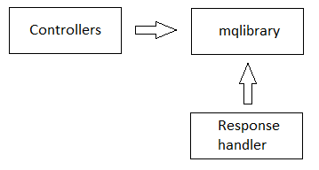

# httpserver

[English](README.md) | [Русский](README.ru.md)

## Архитектура

Примерная архитектура HTTP сервера представлена ниже:

### Контроллер

Контроллер должен хранить следующие параметры:
- имя контроллера и метода (для вычисления HTTP path).
- имена HTTP методов (например, `GET`, `POST`, `PUT` etc).

Также контроллер должен уметь парсить запрос.

### Response handler

Response handler отвечает за обработку ответа на запрос после адаптера, реализующего интерфейс `IReadAdapter`.

Обработка ответа производится следующим образом:
- Response handler реализует метод обработки.
- В `AppInitConfigs` сохраняется делагат (ссылка на метод обработки).
- В конструктор адаптера, реализующего интерфейс `IReadAdapter`, передаётся объект класса `AppInitConfigs`, и делегат сохраняется как член класса.
- Когда адаптер, реализующий интерфейс `IReadAdapter`, обрабатывает запрос, вызывается делегат для обработки запроса.
