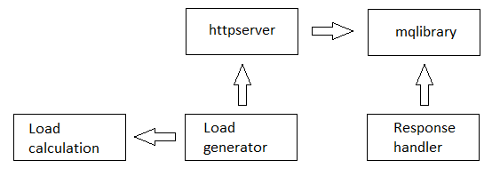
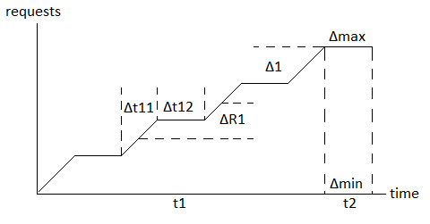
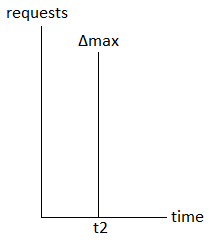

# loadtesting

[English](README.md) | [Русский](README.ru.md)

## Architecture

An example module architecture for load testing is presented below:



In this example, the orchestrator is not implemented; instead, the required applications are launched manually.

## Load testing process

A general diagram illustrating the increase in the number of requests depending on time during load testing is presented in the figure below:



### Types of load testing

It is possible to distinguish several types of load testing:
- One-time increase
- Constant load
- Gradual increase
- Jumping increase
- Fluctuation increase
- Random increase

In this example, only a one-time increase and a constant load are implemented.

#### One-time increase

Diagram of one-time load increase:



Parameters for a one-time load increase:

```
t1 = 0
t2 = 1
delta_min = 0
delta_max > 0
delta_r1 = 0
delta_t11 = 0
delta_t12 = 0
delta1 = 0
```

#### Constant load

Constant load diagram:


Parameters for constant load:

```
t1 = 0
t2 > 0
delta_min = 0
delta_max > 0
delta_r1 = 0
delta_t11 = 0
delta_t12 = 0
delta1 = 0
```

#### Gradual increase

Gradual load increase diagram:


Parameters for gradually increasing the load:

```
t1 > 0
t2 >= 0
delta_min >= 0
delta_max > 0
delta_r1 = 0
delta_t11 > 0
delta_t12 = 0
delta1 = 0
```
#### Jumping increase

Jumping load increase diagram:


Parameters for load ramping:

```
t1 > 0
t2 >= 0
delta_min >= 0
delta_max > 0
delta_r1 = 0
delta_t11 > 0
delta_t12 > 0
delta1 > 0
```

#### Fluctuation increase

Fluctuation load increase diagram:


Parameters for fluctuating load increase:

```
t1 = 0
t2 >= 0
delta_min >= 0
delta_max > 0
delta_r1 > 0
delta_t11 > 0
delta_t12 > 0
delta1 > 0
```

#### Random increase

Parameters for randomly increasing the load:

```
t1 = 0
t2 > 0
delta_min = 0
delta_max > 0
delta_r1 > 0
delta_t11 = 0
delta_t12 = 0
delta1 = 0
```
