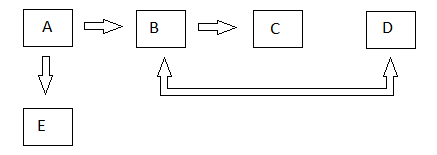
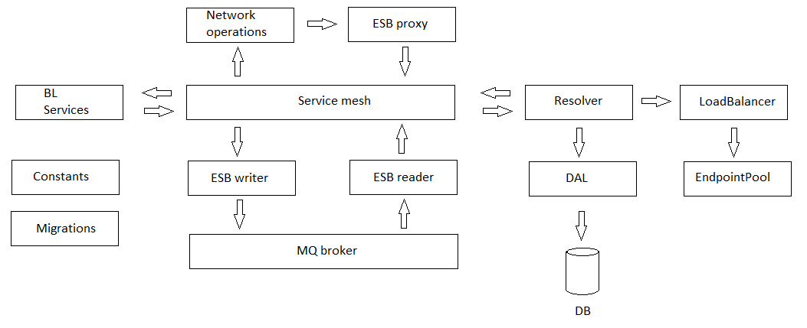
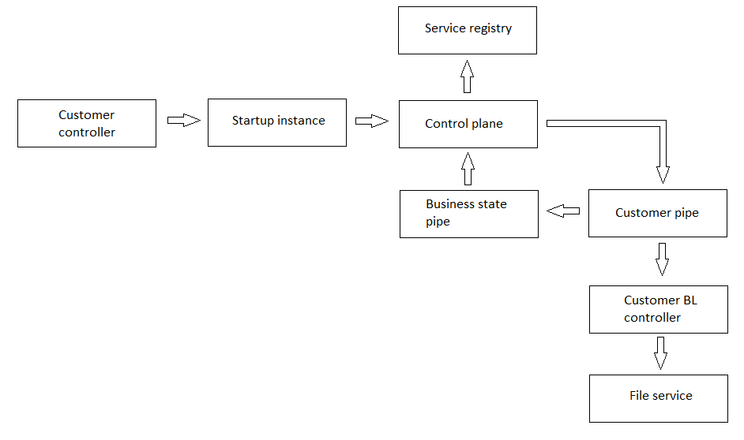

# ServiceInteraction

[English](README.md) | [Русский](README.ru.md)

Let's imagine that there are several components that "communicate" with each other, as shown in the figure below.

There are several points regarding the implementation of components and communication between them:
- these components are implemented as classes in the C# library;
- components communicate not directly, but through a "resolver":
     - the "resolver" accesses the database in order to obtain information about the type of interaction.

There are several types of shells:
- monolith;
- HTTP;
- gRPC.

Algorithms for selecting an endpoint in a distributed system:
- **Random**: A simple and effective method, but can lead to inefficient use of resources, especially if one of the instances is overloaded.
- **Round-robin**: Evenly distributes requests between instances, which helps balance the load. However, it does not take into account the current load of instances.
- **Select the least loaded service**: This method allows you to select the instance with the least load, which can improve performance and resource efficiency (i.e. estimates the total load on the server, including CPU time, CPU load, memory usage, number of active requests, network speed, number of processed requests per unit of time and other parameters).
- **Least Connections**: Select the service with the least number of active connections.
- **Weighted Round-robin**: Distribution of requests taking into account the weights of instances (for example, more powerful servers receive more weight).
- **Least Response Time**: Select the service with the shortest response time.

## Sequence of request processing on services

### Customer

## EndpointPool

There is a collection that stores objects of type `EndpointCollectionParameter` (i.e. information about active endpoints). But it happens that an endpoint becomes temporarily unavailable; accordingly, such an endpoint will need to be removed from the collection. However, this object will remain on the heap until it is removed by the garbage collector. The problem is that when the connection to the endpoint is restored, you will need to create exactly the same endpoint in memory (thus, there will be two endpoints in the managed heap, which is not very correct from the point of view of memory use).

To solve this problem, it is proposed to use the `EndpointPool` class, which will manage the allocation/deallocation of endpoints in memory, implementing the [object pool pattern](https://en.wikipedia.org/wiki/Object_pool_pattern).

### Diagram of interaction between application layers

There's also the diagram that demonstrates in more detail the principle on which the dynamism of the platform is based in the context of choosing the type of client application (MVC, Blazor, WPF etc) and the data transfer protocol between backend services (WebAPI, gRPC).

The diagrams show separate databases for different services; in fact, the database can be either common to all services or separate (however, due to replication, all services must work with data as if it were the same database, i.e. i.e. have identical tables and records in them).

To achieve platform flexibility, controllers should be empty: it is desirable that all data processing logic be located in BL modules.
Thus, the client application can be completely different (ASP.NET MVC, Blazor, WPF, React.js etc), i.e. it becomes responsible only for displaying data on the UI.
For client applications, communication with the database is allowed only for working with the cache.

The client application communicates with its backend service exclusively directly and in most cases over the HTTP protocol.

Microservices can communicate with each other either directly or through a data bus.
The data bus is implemented in two possible ways:
- a common web service for backend and system services (a kind of proxy);
- use of message brokers (for example, RabbitMQ).

### Service discovery 

Details of communication between microservices:
- if service A **knows** which service to contact:
     - service A contacts the resolver to send a request to service B;
     - the resolver accesses the database to determine the method of interaction, based on this it calls the corresponding class from the library [workflow-lib](https://github.com/alexeysp11/workflow-lib) for communication (directly via HTTP, directly via gRPC, HTTP proxy, gRPC proxy, RabbitMQ etc);
     - in the case of any communication via HTTP or gRPC, the calling module simply waits for the response and gives it to the module that initiated the communication and called the resolver;
     - in the case of communication via a message broker, we simply send the status of whether the message is recorded in the queue.
- if service A **doesn’t know** which service to contact:
     - service A contacts the resolver to send a request to the next module;
     - the resolver accesses the database to determine the next module and how to interact with it;
     - after this, all interaction between services is carried out in the same way as in the previous option.

The above methods of interservice communication would allow very flexible configuration of communication between microservices through configs or databases.
The corresponding classes for configuring inter-service communication can be found in the namespace [WorkflowLib.Models.Network.MicroserviceConfigurations](https://github.com/alexeysp11/workflow-lib/tree/main/src/Models/Network/MicroserviceConfigurations).

### Registration and monitoring of the services

