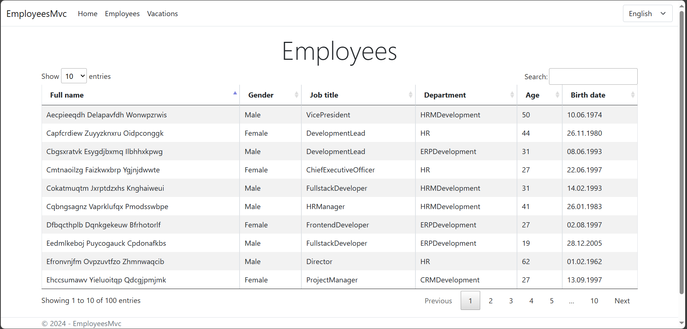
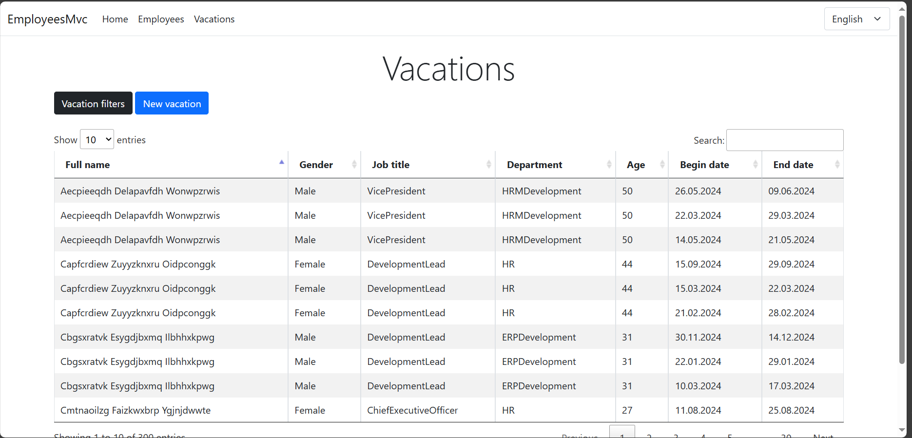

# EmployeesMvc

[English](README.md) | [Русский](README.ru.md)

This project involves creating a software application that can efficiently handle the generation and management of employee vacation data, as well as provide insights into vacation crossings based on specific criteria.

## Overall description 

### Goal 

The goal of the project is to create a software application that can generate employee and vacation data, allow for the entry of new vacation requests, and display information about vacation crossings based on specific criteria.

### Scope

The scope of the project includes generating 100 user objects with specific attributes, creating vacation objects for each user with varying lengths, allowing for the entry of new vacation requests, and implementing algorithms to determine vacation crossings based on specified criteria.

### Who can use this project

This project can be used by HR professionals, managers, or anyone responsible for managing employee vacations and scheduling.

### Possible limitations 

Possible limitations of this project could include the complexity of implementing efficient algorithms for determining vacation crossings, potential challenges in accurately representing and managing large amounts of generated data, and limitations in the flexibility of the application for different organizational structures and vacation policies.

## Requirements  

1. Generate randomly "employees of the company": 100 user objects (full name, gender, position (listing 10 positions), age).
2. Randomly generate "vacation schedule": 3 "vacation" objects (start date, end date, user object) with a length of 14,7,7 days for each created user in the current year.
3. Request the entry of a "new vacation" for the current employee. The length of the new vacation is not more than 14 days.
4. Display information about vacation crossings according to the criteria:
    - Crossing vacations with employees of my department. Employees under 30 years of age.
    - Vacation crossing with female employees not from my department. Age of employees - over 30, but under 50.
    - Vacation crossing with employees from any department. Employees are over 50 years old.
    - Vacations without crossing.
5. It is desirable to use LINQ, lambda expressions.
6. It is desirable to choose the most efficient algorithm for determining intersections.

## Using the application 

Employees: 

Vacations: 

