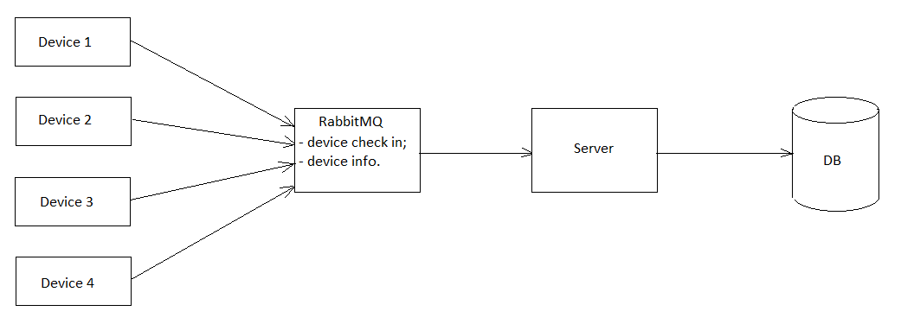
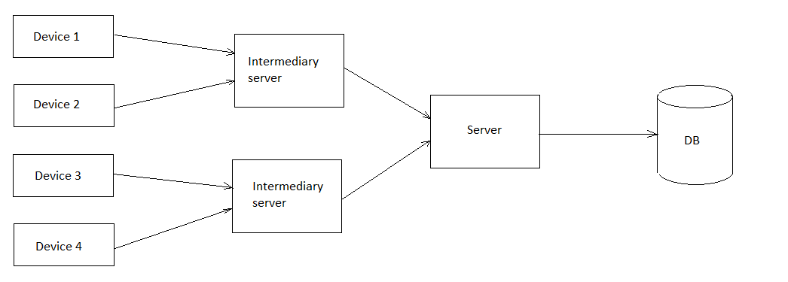

# Архитектура 

[English](architecture.md) | [Русский](architecture.ru.md)

## Простой клиент-серверный подход

Самым очевидным и простым решением для данной задачи может быть использование обычной клиент-серверной архитектуры, при которой устройства отправляют серверу HTTP-запросы, который он обрабатывает и заносит в БД:

В качестве базы данных используется PostgreSQL.

Главный недостаток такого подхода заключается в том, что один сервер не может одновременно обрабатывать слишком много запросов (для нашего приложения лимит примерно 160-200 запросов в секунду).
Поскольку нам нужно обрабатывать 20 000 запросов в секунду, то нам необходимо развернуть от 100 до 125 экземпляров приложения.

Есть несколько способов оптимизировать данный подход: 

- Использование брокера сообщений для увеличения количество обрабатываемых запросов в секунду; 
- Использование промежуточных серверов (т.е. обеспечение "кластеризации" конечных устройств); 
- Сохранение данных локально на уровне оболочки над устройством для уменьшения количества запросов к серверу (например, если отправлять 10 значений в рамках одного запроса, то можно уменьшить количество сетевых запросов к серверу в 10 раз). 

Вышеупомянутые подходы могут быть использованы в комбинации друг с другом. 

## Использование брокера сообщений 

Альтернативным решением может быть использование брокера сообщений (например, RabbitMQ), который бы позволил увеличить количество обрабатываемых запросов в секунду:

## Использование промежуточного сервера 

При использовании промежуточных серверов между конечными устройствами и главным сервером необходимо обеспечить т.н. "кластеризацию" конечных устройств. 
Т.е. возможно дополнительно развернуть 100 экземпляров промежуточного сервера для уменьшения нагрузки на основной сервер. 

Стоит заметить, что данный подход разумемнее реализовывать совместно с локальным сохранением данных (и, соответственно, уменьшением количества сетевых запросов). 
Локальное сохранение можно обеспечить как на уровне конечных устройств, так и на уровне промежуточных серверов - это в свою очередь позволит снизить количество промежуточных серверов. 
