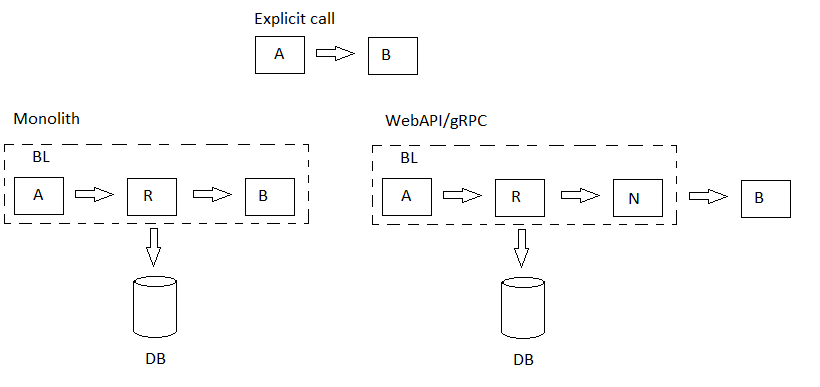

# ServiceInteraction

[English](README.md) | [Русский](README.ru.md)

Let's imagine that there are several components that “communicate” with each other, as shown in the figure below.

There are several points regarding the implementation of components and communication between them:
- these components are implemented as classes in the C# library;
- components communicate not directly, but through a “resolver”:
     - the “resolver” accesses the database in order to obtain information about the type of interaction.

There are several types of shells:
- monolith;
- HTTP;
- gRPC.

Algorithms for selecting an endpoint in a distributed system:
- **Random**: A simple and effective method, but can lead to inefficient use of resources, especially if one of the instances is overloaded.
- **Round-robin**: Evenly distributes requests between instances, which helps balance the load. However, it does not take into account the current load of instances.
- **Select the least loaded service**: This method allows you to select the instance with the least load, which can improve performance and resource efficiency.
- **Least Connections**: Select the service with the least number of active connections.
- **Weighted Round-robin**: Distribution of requests taking into account the weights of instances (for example, more powerful servers receive more weight).
- **IP Hashing**: Select a service based on a hash of the client's IP address.
- **Least Response Time**: Select the service with the shortest response time.
