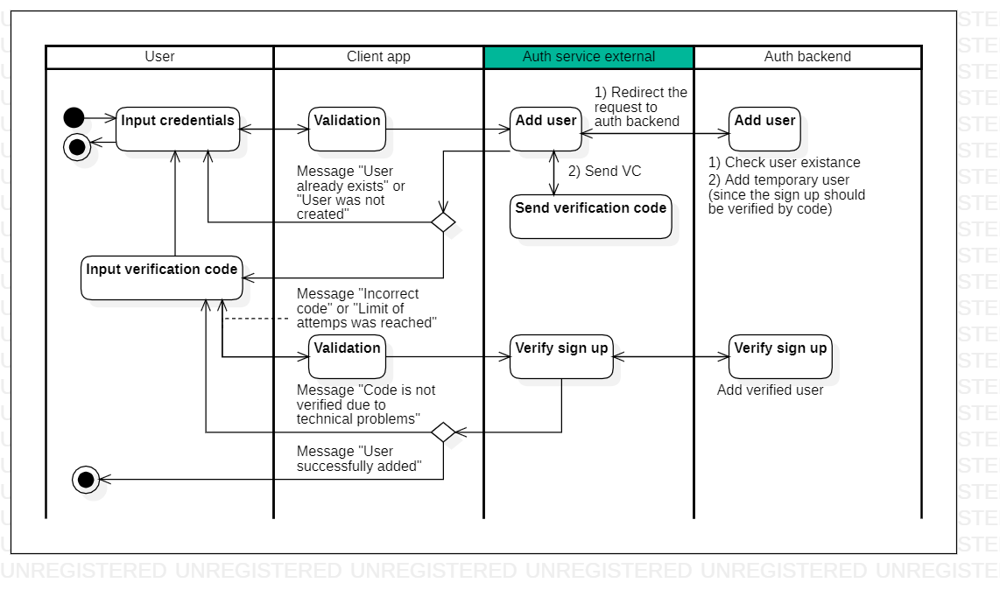

# description

[English](description.md) | [Русский](description.ru.md)

## Step-by-step description of how the client application and service work

### Sign up

1. The user opens the application and selects "Sign up".
2. The user enters login, email, phone number and password (password is entered twice).
     - The form validates the entered values.
     - If **validation is failed**, then an error message is displayed (we remain on the form and give the user the opportunity to enter the data again).
     - If **validation passes**, then a **request to add a user** to the database is sent to the authentication service (login, email, phone), the service returns information on the created user (user creation flag, verification code, date/time of creation verification code).
         - Since users are not stored on the authentication service, the request must be forwarded to the backend service, which stores user information.
         - The backend service checks the presence of the user in the database, and then adds it to the “Temporary user” table if **login does not exist**.
         - If **login exists**, the message “Sorry, a user with this name already exists. Please try again” will be displayed.
     - All changes at this stage are entered into the "Sign up" table.
<!--
     - **Optional** (executed only if necessary at the business logic level of the client application): If **email** and/or **phone exists**, then the message "User with this email and/or phone number" is displayed already exists. For data security reasons, deactivate the previous account or try to remember the password for the previous account" and select "Remember password"/"Deactivate old account"/"Cancel".
         - If the user clicks "Remember password", he is redirected to the application login form.
         - If the user clicks "Deactivate old entry", then the user enters an email or phone number on the new form, clicks "Get deactivation code", a request is sent to the authentication service, the service makes an entry in the "Deactivation" table and in response sends the deactivation code, the user confirms or does not confirm (see point 4). If confirmed, the client application sends a deactivation request, and then all active entries in the user and token tables are marked as outdated and overwritten.
     - On the authentication service side, there is a job that marks entries in the "Sign up" table.
-->
3. When adding a user, a verification code is sent to the specified email/phone number.
4. The user enters the verification code.
     - The entered code is compared with the confirmation code from the service.
     - You are given 3-5 attempts to enter the confirmation code.
     - The confirmation code is stored on the form.
         - If the user **closes the application**, then the registration GUID is lost, so even if the user **enters the application again after closing**, he is taken to the registration form and repeats all the steps again (the old attempt must be overwritten in step 1 ).
     - If the user **confirmed the code**, then **we send a request** to the authentication service to **set the registration closing code** as "success".
5. The user returns to the application login form (login entry).

### Sign in 

1. The user opens the application and selects "Sign in".
2. The user enters login and password.
     - The form validates the entered values.
     - If **validation fails**, then an error message is displayed (we remain on the form and give the user the opportunity to enter the data again).
     - If **validation passes**, then a **request for user verification** (login, password) is sent to the authentication service.
         - The request is redirected to the backend service.
     - If **the user is not verified**, then we display the error message "Invalid login or password. Please try again."
     - If **the user is verified**, then a **request to receive a session token** is sent to the authentication service.
         - If, when sending a session token to a client, it turns out that the token has expired, then its expiration date must be updated.
     - All changes at this stage are entered into the "Sign in" table.
     <!--
     - If there are several login attempts in the temporary table during the day for the same user, then it is likely that they are trying to hack him, so after the nth time the exception "the number of login attempts has been exceeded" should be sent.
     -->
3. The user enters the application.

## Network communication

Network requests are processed using the [AuthResolver](authbl/AuthResolver.md) class.

### Sign up 

- **Add user** - adding a user (method: `AddUser()`).
- **Verify sign up** - verification of registration completion (method: `VerifySignUp()`).
<!--
- **Get deacitvation code** - getting the deactivation code (method: `GetDeactivationCode()`).:
     - input: `UserCredentials`;
     - output: `DeactivationCode`.
- **Deactivate users** - deactivate users (method: `DeactivateUsers()`).:
     - input: `DeactivationRequest`;
     - output: `DeactivationResponse`.
-->

### Login to the application

- **Verify user credentials** - user verification (method: `VerifyUserCredentials()`).
- **Get token by user UID** - updating the session token by user UID (method: `GetTokenByUserUid()`).

### Data transfer objects

- [UserCredentials](models/NetworkParameters/UserCredentials.md) - user data.
- [UserCreationResult](models/NetworkParameters/UserCreationResult.md) - the result of adding a user to the database.
- [VSURequest](models/NetworkParameters/VSURequest.md) - request to confirm registration using a verification code.
- [VSUResponse](models/NetworkParameters/VSUResponse.md) - response to confirmation of registration using the verification code.
- [VUCResponse](models/NetworkParameters/VUCResponse.md) - response to verification of user data when entering a login.
- [TokenRequest](models/NetworkParameters/TokenRequest.md) - request to obtain a session token for the user.
- [SessionToken](models/NetworkParameters/SessionToken.md) - session token.

### Tables in the database

- [auth_session_token](dbtables/auth_session_token.md) - session token (corresponds to [SessionToken](models/NetworkParameters/SessionToken.md)).
- [auth_signup](dbtables/auth_signup.md) - sign up (corresponds to [AuthSignUp](models/AuthSignUp.md)).
- [auth_signin](dbtables/auth_signin.md) - sign in (corresponds to [AuthSignIn](models/AuthSignIn.md)).
- [auth_closing_code](dbtables/auth_closing_code.md) - authentication closing code (corresponds to [AuthClosingCode](models/AuthClosingCode.md) or [AuthClosingCodeType](models/AuthClosingCodeType.md)).
