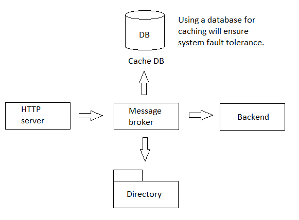

# file-mq-broker

[English](README.md) | [Русский](README.ru.md)

## Description

Let's imagine a system that processes incoming HTTP traffic, queries the backend and returns its result in the response. Communication with the backend needs to be designed through a file message broker, so the backend API does not have a synchronous "request-reply" API.



It is necessary to implement two versions that implement the solution to the problem.
- In a "naive" (primitive) implementation of the system, all incoming requests arrive at the broker and wait for a response from it, which is passed on to the caller.
- In an advanced implementation, it is required to collapse identical requests into one request to the broker. The identity is determined through a function that extracts the key from the request. After the collapse procedure (i.e. sending responses to the caller), the next batch of "same" requests again generates a request to the broker.

### Implementation details

A more detailed diagram demonstrating how a file message broker works is presented below:


- Use the directory as a broker where the request (method, path) is placed in a file named `query key.req`.
- The broker's response is expected in the file `request key.resp`, where the first line will be the HTTP code, and the rest is the response body for the caller.
- After proofreading the response, the response and request files must be deleted from the disk by the service.
- Think about how the implementation will be changed to "real" brokers that have the ability to notify clients about a message in the channel (for example, any AMQP broker).
- Think through various possible errors, for example:
     - broker unavailability (no catalog in our implementation),
     - caller timeouts (scenario: two callers with one request with a time difference of 1 minute, response 1.5 minutes from the first request, and callers timeout - 1 minute),
     - service crash and restart (the queue can be restored using records in the database),
     - error in response format,
     - impossibility of deleting a response and/or request.
- Calculate the key for saving the file using the MD5 formula (HTTP method + HTTP path). This key should not be confused with the key used for query collapsing, as it is at the discretion of the developer.
- Replies can be quite separated in time from the response, so that one of the callers waiting for a response can forcefully close the connection without waiting for a response.
- Broker settings in the config file (storage directory).

## Pre-initialization of the environment

1. Initialize the `data` folder, which contains the data that is generated as part of the application execution:
```
initdatafolder.cmd
```
2. Initialize the database:
     - If you intend to use SQLite, then you need to open the database file `data/db/test.db` and execute the commands that are in the file `sql/sqlite/create.sql`. In order to open the database, you can use the batch file `opentestdb.cmd`.
     - If you plan to use PostgreSQL, then you need to create a `filemqbroker` database and run the commands that are in the `sql/postgres/create.sql` file.

## Testing

### How it could be tested

- A load of 10-20 thousand requests will be created, in batches based on the identity of the key; various responses to batches of queries will also be created in the background and the results will be analyzed.
- Logs are read from stdout.
- We automatically take metrics on the number of threads (system) and on their degradation and memory based on increased load.
- Use of synchronization primitives.
- General execution of the task in code, use of OOP, the ability to expand/replace functionality with little effort (change of broker, key functions, settings storage).
- (not critical) Availability of unit tests.
- (not critical) the presence of load tests and benchmarks.
- Code readability.

### How to run tests

To run tests, you need to run two instances of the application:
1. Load generation application:
```
runloadtesting.cmd
```
2. Application for processing a request on the backend service:
```
runbackendservice.cmd
```
