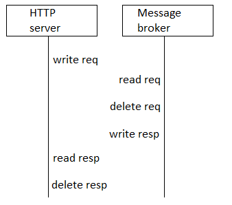

# requestprocessing

[English](requestprocessing.md) | [Русский](requestprocessing.ru.md)

Для обеспечения высокой производительности файлового брокера сообщений рекомендуется использовать многопоточное/асинхронное программирование. Асинхронный подход, при котором задачи обрабатываются параллельно, может значительно повысить скорость обработки сообщений.

## Последовательность обработки запроса

### Отправка сообщения

Предполагается, что клиентское приложение, использующее данный файловый брокер, по умолчанию выполняет следующие функции:
- проверка корректности имени вызываемого метода.
- проверка целостности сообщения.
- проверка формата ответа.

Для непосредственной коммуникации с данным файловым брокером необходимо использовать компонент [mqlibrary](../mqlibrary/README.ru.md), который обеспечит корректный вызов брокера.

### Прием сообщения на стороне брокера сообщений

Запись данных о входящем запросе в БД для кэша (записывать HTTP method, HTTP path, тело запроса, время).

### Генерация имени файла

При генерации ключа для имени файла только на основе наименования метода и пути могут возникнуть коллизии, поэтому перед сгенерированным ключом в имени файла лучше добавлять текущую дату и время. 
Такое решение позволит избежать коллизий наименований и обеспечить механизм очереди.

Пример имени файла:
```
20240229223457988.7f83b1657ff1fc53b92dc18148a1d65dfc2d4b1fa3d677284addd200126d9069
```

### Работа с файлами

Последовательность работы с файлами представлена на рисунке ниже:



При работе с файлами могут быть выделены следующие правила:
- Синхронизация между сервисами может производиться с помощью общей БД.
- Во время работы с файлом (запись, чтение, удаление) должна производиться блокировка файла.
- Для того, чтобы выянить, какой файл находится в состоянии блокировки, можно использовать очередь блокировок файлов.

Файл может находиться в следующих состояниях:
- запись.
- чтение.
- удаление.
- готов к записи.
- готов к чтению.
- готов к удалению.
- ошибка записи.
- ошибка чтения.
- ошибка удаления.
- удалён.

#### Запись в файл запроса

Запись в файл запроса производится на стороне "клиентского" приложения [httpserver](../httpserver/README.ru.md).

#### Чтение из файла запроса

Чтение из файла запроса производится сервисом [backgroundmq](../backgroundmq/README.ru.md), который представляет собой отдельное background приложение.

После чтения файла сервис [backgroundmq](../backgroundmq/README.ru.md) удаляет прочитанный файл.

#### Запись в файл ответа

Запись в файл ответа производится сервисом [backgroundmq](../backgroundmq/README.ru.md).

#### Чтение из файла ответа

Чтение из файла запроса производится сервисом [httpserver](../httpserver/README.ru.md). 
Важно отметить, что данную операцию выполняет фоновый процесс в рамках "клиентского" приложения.

После чтения файла сервис [httpserver](../httpserver/README.ru.md) удаляет прочитанный файл.

После удаления файла сервис инициирует уведомление вызывающего сервиса по HTTP.
