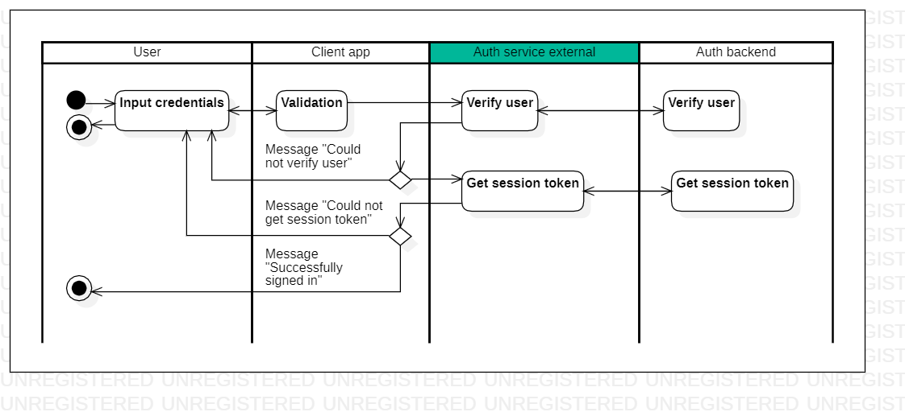

# description

[English](description.md) | [Русский](description.ru.md)

## Пошаговое описание работы клиентского приложения и сервиса 

### Регистрация 

1. Пользователь открывает приложение и выбирает "Зарегистрироваться". 
2. Пользователь вводит логин, email, телефон и пароль (пароль вводится дважды).
    - На форме производится валидация введенных значений.
    - Если **валидация не прошла**, то высвечивается сообщение об ошибке (остаемся на форме и даем пользователю возможность ввести данные ещё раз).
    - Если **валидация прошла**, то на сервис аутентификации отправляется **запрос на добавление пользователя** в БД (логин, email, телефон), сервис возвращает информацию по созданному пользователю (флаг создания пользователя, код верификации, дата/время создания кода верификации).
        - Поскольку пользователи не хранятся на сервисе аутентификации, то запрос должен быть переслан на бэкенд сервис, который хранит пользовательскую информацию.
        - Бэкенд сервис проверяет наличие пользователя в БД, после чего добавляет его во таблицу "Временный пользователь", если **логин не существует**.
        - Если **логин существует**, то высвечивется сообщение "К сожалению, пользователь с таким именем уже существует. Пожалуйста, попробуйте снова".
    - Все изменения на данном этапе заносятся в таблицу "Регистрация".
<!--
    - **Опционально** (исполняется только в случае необходимости на уровне бизнес-логики клиентского приложения): Если **email** и/или **телефон существует**, то высвечивается сообщение "Пользователь с таким email и/или номером телефона уже существет. Из соображений безопасности данных, деактивируйте предыдущую учетную запись либо попробуйте вспомнить пароль к предыдущему аккаунту" и выбор "Вспомнить пароль"/"Деактивировать старую запись"/"Отмена".
        - Если пользователь нажимает "Вспомнить пароль", то он перенаправляется в форму входа в приложение.
        - Если пользователь нажимает "Деактивировать старую запись", то пользователь на новой форме вводит email или номер телефона, нажимает "Получить код деактивации", на сервис аутентификации отправляется запрос, сервис делает запись в таблице "Деактивация" и в ответ отправляет код деактивации, пользователь подтверждает или не подтверждает (см. пункт 4). Если подтверждает, то клентское приложение отправляет запрос на деактивацию, и тогда все активные записи в таблицах пользователей и токенов помечаются как устаревшие и перезаписанными.
    - На стороне сервиса аутентификации работает джоба, которая отмечает записи в таблице "Регистрация".
-->
3. При добавлении пользователя на указанный email/телефон отправляется код верификации.
4. Пользователь вводит код подтверждения.
    - Введенный код сравнивается с кодом подтверждения из сервиса.
    - На ввод кода подтверждения дается 3-5 попыток.
    - Код подтверждения хранится на форме.
        - Если пользователь **закрыл приложение**, то GUID регистрации теряется, поэтому даже если пользователь **после закрытия заходит снова** в приложение, то он попадает на форму регистрации и повторяет все действия снова (старая попытка должна быть перезаписывана на этапе 1).
    - Если пользователь **подтвердил код**, то **отправляем запрос** на сервис аутетентификации, чтобы **поставить код закрытия** регистрации как "успех".
5. Пользователь вовращается в форму входа в приложение (ввода логина).

### Вход в приложение 

1. Пользователь открывает приложение и выбирает "Войти". 
2. Пользователь вводит логин и пароль.
    - На форме производится валидация введенных значений.
    - Если **валидация не прошла**, то высвечивается сообщение об ошибке (остаемся на форме и даем пользователю возможность ввести данные ещё раз).
    - Если **валидация прошла**, то на сервис аутентификации отправляется **запрос на верификацию пользователя** (логин, пароль).
        - Запрос переадресуется на бэкенд сервис.
    - Если **пользователь не верифицирован**, то отображаем сообщение об ошибке "Неверный логин или пароль. Пожалуйста, пробуйте ещё раз".
    - Если **пользователь верифицирован**, то на сервис аутентификации отправляется **запрос на получение сессонного токена**.
        - Если при отправке сессионного токена кленту выясняется, что токен просрочен, то у него должна быть обновлена дата окончания.
    - Все изменения на данном этапе заносятся в таблицу "Вход в приложение".
    <!--
    - Если во временной таблице несколько попыток входа в течение дня для одного и того же пользователя, то вероятно, что его пытаются взломать, поэтому после n-го раза должно отправляться исключение "превышено количество попыток входа".
    -->
3. Пользователь попадает в приложение.

## Сетевое взаимодействие

Обработка сетевых запросов производится внутри класса [AuthResolver](authbl/AuthResolver.md).

### Регистрация 

- **Add user** - добавление пользователя (метод: `AddUser()`).
- **Verify sign up** - верификация завершения регистрации (метод: `VerifySignUp()`).
<!--
- **Get deacitvation code** - получение кода деактивации (метод: `GetDeactivationCode()`):
    - input: `UserCredentials`; 
    - output: `DeactivationCode`.
- **Deactivate users** - деактивация пользователей (метод: `DeactivateUsers()`): 
    - input: `DeactivationRequest`;
    - output: `DeactivationResponse`.
-->

### Вход в приложение 

- **Verify user credentials** - верификация пользователя (метод: `VerifyUserCredentials()`).
- **Get token by user UID** - обновление сессионного токена по UID пользователя (метод: `GetTokenByUserUid()`).

### Data transfer objects

- [UserCredentials](models/NetworkParameters/UserCredentials.md) - пользовательские данные.
- [UserCreationResult](models/NetworkParameters/UserCreationResult.md) - результат добавления пользователя в БД.
- [VSURequest](models/NetworkParameters/VSURequest.md) - запрос на подтверждение регистрации с помощью верификационного кода.
- [VSUResponse](models/NetworkParameters/VSUResponse.md) - ответ на подтверждение регистрации с помощью верификационного кода.
- [VUCResponse](models/NetworkParameters/VUCResponse.md) - ответ на верификацию пользовательских данных при вводе логина.
- [TokenRequest](models/NetworkParameters/TokenRequest.md) - запрос на получение сессионного токена для пользователя.
- [SessionToken](models/NetworkParameters/SessionToken.md) - сессионный токен.

### Таблицы в БД 

- [auth_session_token](dbtables/auth_session_token.md) - сессионный токен (соответствует [SessionToken](models/NetworkParameters/SessionToken.md)).
- [auth_signup](dbtables/auth_signup.md) - регистрация (соответствует [AuthSignUp](models/AuthSignUp.md)).
- [auth_signin](dbtables/auth_signin.md) - вход в приложение (соответствует [AuthSignIn](models/AuthSignIn.md)).
- [auth_closing_code](dbtables/auth_closing_code.md) - код закрытия аутентификации (соответствует [AuthClosingCode](models/AuthClosingCode.md) или [AuthClosingCodeType](models/AuthClosingCodeType.md)).
